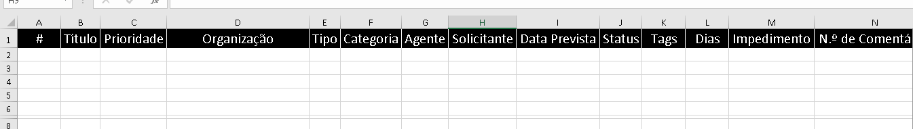

### Sistema automatizado de envio de formulários

 
> ## Visão geral
Este projeto foi desenvolvido para enfrentar os desafios do gerenciamento repetitivo de tarefas no espaço de trabalho que estava enfrentando no meu trabalho, com foco particular na automação do envio de formulários. A iniciativa surgiu da necessidade de agilizar o processo de cadastramento de múltiplas organizações em um sistema da minha organização, tarefa demorada e propensa a erros humanos. Ao aproveitar o poder da automação, este sistema reduz significativamente o esforço manual, aumenta a precisão e aumenta a eficiência operacional.

<div style="display: flex; justify-content: space-between;">


</div>

 
 > ## Features 🚀
- :heavy_check_mark: Automação de envio de formulários : preenche e envia formulários automaticamente para uma lista de organizações.
<BR>
- :heavy_check_mark: Tratamento de erros : gerencia exceções com elegância, garantindo que o sistema permaneça operacional mesmo quando encontrar erros imprevistos.
<BR>
- :heavy_check_mark: Eficiente em termos de tempo : reduz drasticamente o tempo necessário para concluir registros em massa, liberando recursos para outras tarefas críticas.
<BR>
- :heavy_check_mark: Fácil de usar : Projetado com a simplicidade em mente, exigindo intervenção mínima do usuário assim que o processo for iniciado.


 > ## Technologies Used  🚀

-:heavy_check_mark: Selenium WebDriver 
    <br>
-:heavy_check_mark: Python 
    <br>
-:heavy_check_mark: Pandas 

 
  
> ## Run 🚀

```  
pip install selenium
pip install pandas
``` 
 

 > ## Uso**

Para usar o sistema, siga estas etapas:

 - :heavy_check_mark: Atualize a file_pathvariável com o caminho para o seu arquivo Excel.
 <br>
 - :heavy_check_mark: Defina o Servicecaminho para o local do seu WebDriver.
  <br>
 - :heavy_check_mark: Certifique-se de que o URL de destino para envio do formulário esteja especificado corretamente no script.
  <br>
 - :heavy_check_mark: Execute o script. Ele lerá automaticamente a lista de organizações do arquivo Excel e prosseguirá com o envio do formulário.
 <br>

  ## Screenshot




## 🤝 Desenvolvedor

> Software Engineer

<table align="center">
  <tr>
    <td align="center">
      <a href="">
        <br>
        <sub>
          <b>Erick Rodrigues</b>
        </sub>
      </a>
    </td>
  </tr>
</table>


## 📝 Licença

Este projeto está sob licença. Consulte o arquivo [LICENSE](LICENSE) para obter mais detalhes.

&#xa0;


<a href="#top">Volte para o topo</a>
